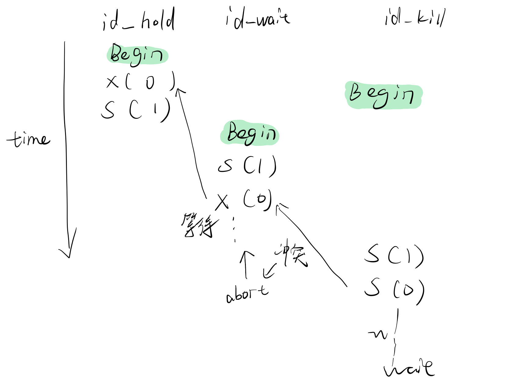
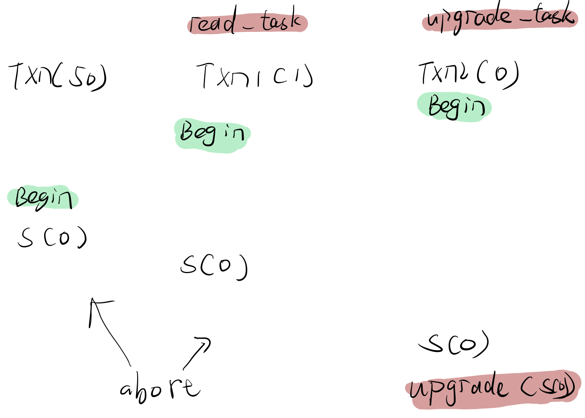

# lab4

lab4 实现一个 `lockmanager`，支持 sharedlock、exclusivelock、upgradelock、unlock，这些操作。lab4 的难度不是很难，共享互斥锁以及 wound-wait 策略并不难想，初期建议看下内部实现好的 RWlock，理解好思想，然后好好的写，再根据测试用例认真修改，画出事务图，改 bug，其实并不难。lab4 花费的时间 16h37min。

本篇重点讲一下 lab 的坑点和 hints。

### Hints

* 熟悉隔离级别的概念。
* 熟悉条件变量的使用，可以看看 std::future 和 std::promise 的用法，有助于读懂测试用例。
* 每次加锁或者升级锁，都要死锁预防。
* 每次中断事务或者解锁，都要提醒阻塞线程。
* 考虑 sharedlockset 和 exclusivelockset 是否包含未授予但加入到请求队列中的锁。
* 如果出现 memory safety timing out，一般是太慢了，考虑别在 lockshared 和 lockexclusive 一开始就加锁。
* shrinking 阶段的赋予很有意思，不是说 unlock 了就是 shrinking 阶段了，aborted 的事务也会 unlock。
* 思考每个条件变量的 wait 谓词，并且都要判断事务在等待的阶段是否已经 aborted 了。
* 我默认的 LockUpgrade 中要升级的锁是 granted。

### 隔离级别

Read uncommitted：读不加锁，写加 exclusive lock。&#x20;

Read committed：读加 shared lock，写加 exclusive lock。&#x20;

Repeatable read：读加 shared lock， 写加 exclusive lock，遵守 2PL 规则。

### 迭代器失效？

由于不存在在一个 tuple 上加上两个及两个以上的锁，所以当我们 unlock 遍历请求队列（list）时，只 erase 一个就 break 了，当然由于是（list）双端链表，即便 erase 很多，也不会出现迭代器失效的情况。

### Wound-Wait

简单的来说就是 **老事务伤害新事务，新事务等待老事务**。Wound-wait 想要到达一种什么效果那？就是 tuples 的请求队列中授予锁的顺序是 older-younger 的。

具体来说：&#x20;

For shared lock, abort all the younger exclusive lock requests before the request by the current txn.&#x20;

For write lock, abort all the younger requests before the request by the current txn.&#x20;

For upgrade lock, abort all the younger but granted requests before the request by the current txn.

