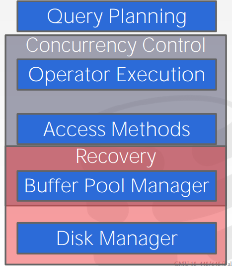

# Concurrency Control Theory

DBMS 的并发控制和恢复组件贯穿其整个架构的设计。

我们希望的 DBMS 既可以同时更新相同的对象（并发控制），也可以面对故障时返回到我们原来的状态（恢复）。这些是 DBMS 非常有价值的财产，而他们全都是基于拥有 ACID 的事务（transaction）。

### Transactions

事务是什么那？事务是一种 high-level 的概念，它是数据库在执行 **high-level 操作** 时底层触发的一系列操作，例如：SQL 查询等。它是 DBMS 修改内部的基础单元。一半的事务是不被允许的。

让我们举个事务的例子。把 Andy 账户的 $100 打入到我的账户上。简单想一下，它可以分为几个阶段；
1. 检查 Andy 账户是否有 $100。
2. 在 Andy 的账户上扣除 $100。
3. 在我的账户上增加 $100。
 
我们可不希望在其中某个阶段停下来，它们是一个整体，要发生就要一起发生，那么这就是一个事务。

在 DBMS 中执行并发的事务是极具挑战的。要想快速的并发的执行事务同时又要保证正确性是很困难的，这可不是加个锁那么简单。我们需要一些正确性标准：
- 暂时的非一致性是被允许的
- 永久的非一致性是不对的

事物的范围只能在数据库内部，他不能改变数据库外部的东西，也不能回滚那些操作。

### Definitions

数据库是对象（A，B，C）的集合，事务是一系列的读和写的操作 ( **R(A)**, **W(B)** )。

事务的输出要么是 COMMIT 和 ABORT。
- COMMIT 意味着事务的所有修改都会在数据库内保存
- ABORT 意味着事务的所有修改都会被取消，就像一些没有发生一样。

正确性标准（Correctness Criteria）：**ACID**

- Atomicity: 事物的所有操作要么都发生要么不发生。
  “All or Nothing”
- Consistency: 如果每个事务是一致的，那么在事务开始之前数据库是一致的，在事务完成了数据库也是一致的。
  “It looks correct to me...”
- Isolation: 事务之间是隔离的。
  “As if alone”
- Durability: 如果事务提交了，那么它的作用是永久的。
  “The transaction’s changes can survive failures...”

### ACID: Atomicity

DBMS 保证事务时原子性的，要么执行所有的操作，要么什么都不做。

**Approach #1: Shadow Paging**
- DBMS 对页进行拷贝而事务只对副本进行修改，仅仅等到提交了，对页的修改才对其他事务可见。
- 这是个老方法，现在没人用了。

**Approach #1: Logging**
- DBMS 会 log 所有的操作这样它可以回滚一些操作帮助事务的 ABORT。
- 他就是飞机的黑盒子
- 这个方法被用在几乎所有的现在数据库，甚至文件系统也有了 logging。

### ACID: Consistency

数据库所代表的“世界”是一致的（例如，正确的）。 应用程序询问数据的所有问题（即查询）都将返回正确的结果。

**Database Consistency:**
- 数据库准确地表示它正在建模的现实世界实体并遵循完整性约束。
- 未来的事务会看到过去在数据库内部提交的事务的影响。

**Transaction Consistency:**
- 如果数据库在事务开始之前是一致的，那么之后也是一致的。
- 确保事务一致性是应用程序的责任。

### ACID: Isolation

DBMS 为事务提供了它们在系统中单独运行的错觉。它们无法看到并发事务的影响。好似在一个串行的系统内执行一样。但是为了更好的性能，DBMS 必须交错事务的执行。

#### Concurrency Control

*concurrency control protocol* 是 DMBS 怎么去决定一个正确的多事务交错顺序。

Two categories of protocols:
1. **Pessimistic:** DBMS 假设事务都会发生冲突，它不会让问题发生。
2. **Optimistic:** DBMS 假设事务冲突是稀少的，它会当冲突发生时解决。

DBMS 执行操作的顺序被称为执行调度。*concurrency control protocol* 的目的就是生成一种相同与串行执行的执行调度。
- **Serial Schedule:** 不会交错不同事务的调度器。
- **Equivalent Schedules:** 对于任何数据库状态，执行第一个调度的效果与执行第二个调度的效果相同。
- **Serializable Schedule:** 相当于事务的某些串行执行的计划。

当 DBMS 交错一些并发事务时，它创造一些异常：
- **Read-Write Conflicts (“Unrepeatable Reads”):** 一个事务在读多次相同的对象之后不能得到相同的值。
- **Write-Read Conflicts (“Dirty Reads”):** 在该事务提交其更改之前，事务会看到不同事务的写入效果。
- **Write-Write conflict (“Lost Updates”):** 一个事务重写了另一个事务已写但未提交的对象。

知道这些冲突之后，我们理解了一个调度如何才能串行的。当然有不同级别的可串行化：
1. Conflict Serializability 
2. View Serializability

#### Conflict Serializability

调度器是相同于一些其他的串行调度器。
如果你能够通过交换不同事务的连续非冲突操作将 S 转换为串行调度，则调度 S 是可冲突序列化的。这可以解决两个事务之间的冲突，但是多个事务之间的冲突是繁琐的。
**Dependency Graphs (aka “precedence graph”):**
- 每个事务一个结点
- 如果 $$T_i$$ 的操作 $$O_i$$ 与 $$T_j$$ 的操作 $$O_j$$ 冲突并且 $$O_i$$ 出现在调度中的时间早于 $$O_j$$，则从 $$T_i$$ 到 $$T_j$$ 有一条边
- 当且仅当它的依赖图是非循环的时，调度是冲突可序列化的。

### ACID: Durability

已提交事务的所有更改在崩溃或重启后必须是持久的（即持久的）。 DBMS 可以使用日志记录或影子分页来确保所有更改都是持久的。