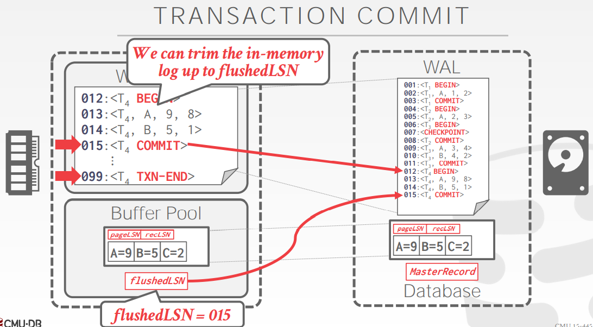
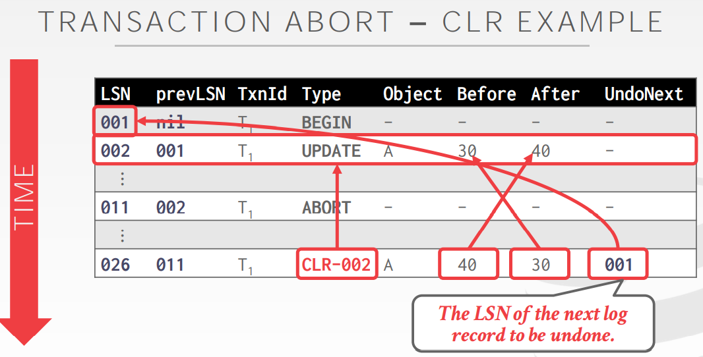

# Crash Recovery Algorithms

Algorithms for Recovery and Isolation Exploiting Semantics(ARIES)。

ARIES 开发于上世纪九十年代的 IBM 的 DB2。现在的大部分系统并没有完整的实现原始论文中定义的 ARIES，但是它们都是十分相似的。

ARIES 恢复协议的主要思想：
- **Write Ahead Logging:** 在将数据库更改写入磁盘之前，任何更改都会记录在稳定存储的日志中（STEAL + NO-FORCE）。
- **Repeating History During Redo:** 重新启动时，回溯操作并将数据库恢复到崩溃前的确切状态。
- **Logging Changes During Undo:** 将撤消操作记录到日志中，以确保在重复失败的情况下不会重复操作。

### WAL Records

我们需要扩展 DBMS 的日志记录格式以包含附加信息。现在，每条日志记录都包含一个全局唯一的日志序列号 (LSN)。系统中的各种组件会跟踪与其相关的 LSN：
- 每个数据页都包含一个 pageLSN：该页最近更新的 LSN
- 系统跟踪 flushedLSN：到目前为止已刷新的最大 LSN
- 在第 $$i$$ 页可以写入磁盘之前，我们必须至少将日志刷新到 $$pageLSN_i ≤ flushedLSN$$

### Normal Execution

我们首先讨论 DBMS 在运行时执行事务时所采取的步骤。

#### Transaction Commit

当一个事务将要提交时，DBMS 会首先写下 COMMIT 记录在内存中的日志缓冲。然后 DBMS 将所有日志记录刷新到磁盘，包括事务的 COMMIT 记录。请注意，这些日志刷新是对磁盘的顺序、同步写入。

一旦 COMMIT 安全的存储在硬盘中，DBMS 向应用程序返回事务已提交的确认。**在之后的一段时间后**，DBMS 会写入一个特殊的 TXN-END 记录到日志中。这表明事务已经完全的完成而日志也不再存储任何关于此事务的记录。这些 TXN-END 记录用于内部记账，不需要立即刷新。

#### Transaction Abort

中止事务是仅适用于一个事务的 ARIES 撤消操作的一种特殊情况。

我们需要在我们的日志记录中添加另一个字段，称为 prevLSN。这对应于事务的先前 LSN。DBMS 使用这些 prevLSN 为每个事务维护一个链表，以便更轻松地遍历日志以查找其记录。

我们还需要引入一种称为补偿日志记录 (compensation log record : CLR) 的新型记录。CLR 描述了为撤消先前更新记录的操作而采取的操作。它具有更新日志记录的所有字段以及 undoNext 指针（即，下一个要撤消的 LSN）。DBMS 像任何其他记录一样将 CLR 添加到日志中，但它们永远不需要撤消。

要中止事务，DBMS 首先将 ABORT 记录附加到内存中的日志缓冲区。然后它以相反的顺序撤消事务的更新，以从数据库中删除它们的影响。对于每个撤消的更新，DBMS 在日志中创建 CLR 条目并恢复旧值。在所有中止事务的更新都被反转后，DBMS 然后写入一条 TXN-END 日志记录。

### Checkpointing

DBMS 定期获取检查点，将缓冲池中的脏页写入磁盘。这用于最小化恢复时必须重播的日志量。

我们首先讨论两种阻塞检查点方法，其中 DBMS 在检查点过程中暂停事务。这种暂停是必要的，以确保 DBMS 在检查点期间不会错过对页面的更新。然后，我们提出了一种更好的方法，允许事务在检查点期间继续执行，但需要 DBMS 记录附加信息以确定它可能错过的更新。

#### Blocking Checkpoints

DBMS 在设置检查点时会暂停所有操作，以确保将数据库的一致快照写入磁盘。这与上一课讨论的方法相同：
- 停止任何新事务的开始。
- 等到所有活动事务完成执行。
- 刷新磁盘上的脏页。

#### Slightly Better Blocking Checkpoints

与之前的检查点方案类似，只是 DBMS 不必等待活动事务完成执行。我们现在必须记录检查点开始时的内部系统状态。
- 停止任何新事务的开始。
- 在 DBMS 执行检查点时暂停事务。

**Active Transaction Table (ATT):** ATT 代表在 DBMS 中活跃运行的事务的状态。在 DBMS 完成该事务的提交/中止过程后，将删除事务的条目。对于每个交易条目，ATT 包含以下信息：
- *transactionId*：唯一的事务标识符
- *status*: 事务的当前“模式”（运行、提交、撤消候选）
- *lastLSN*: 事务写入的最新 LSN

**Dirty Page Table (DPT):** DPT 包含有关缓冲池中由未提交事务修改的页面的信息。每个脏页有一个条目包含 recLSN（即，首先导致页面变脏的日志记录的 LSN）。

#### Fuzzy Checkpoints

模糊检查点是 DBMS 允许其他事务继续运行的地方。这就是 ARIES 在其协议中使用的内容。

DBMS 使用额外的日志记录来跟踪检查点边界：
- \<CHECKPOINT-BEGIN>：表示检查点的开始。
- \<CHECKPOINT-END>：检查点完成时。 它包含 ATT + DPT。

### ARIES Recovery

ARIES 协议由三个阶段组成。在崩溃后启动时，DBMS 将执行以下阶段：
1. **Analysis:** 读取 WAL 以识别缓冲池中的脏页和崩溃时的活动事务。
2. **Redo:** 从日志中的适当点开始重复所有操作。
3. **Undo:** 反转崩溃前未提交的事务的操作。

#### Analysis Phase

从通过数据库的 MasterRecord LSN 找到的最后一个检查点开始。
- 从检查点向前扫描日志。
- 如果 DBMS 找到一条 TXN-END 记录，则从 ATT 中删除其事务。
- 所有其他记录，将事务添加到状态为 **UNDO** 的 ATT，并在提交时将事务状态更改为 **COMMIT**。
- 对于 UPDATE 日志记录，如果页面 P 不在 DPT 中，则将 P 添加到 DPT 并将 P'srecLSN 设置为日志记录的 LSN。

#### Redo Phase

目标是重复历史以重建崩溃时刻的状态。重新应用所有更新（甚至中止事务）并重做 **CLRs**。DBMS 从 DPT 中包含最小 recLSN 的日志记录开始向前扫描。对于具有给定 LSN 的每个更新日志记录或 CLR，DBMS 会重新应用更新，除非：
- 受影响的页面不在 DPT 中，或者
- 受影响的页面在 DPT 中，但该记录的 LSN 大于最小的 recLSN，或者
- 受影响的页面 LSN（在磁盘上）≥ LSN。

要重做一个操作，DBMS 重新应用日志记录中的更改，然后将受影响页面的 pageLSN 设置为该日志记录的 LSN。

在重做阶段结束时，为所有状态为 COMMIT 的事务写入 TXN-END 日志记录，并将它们从 ATT 中删除。

#### Undo Phase

在最后一个阶段，DBMS 会反转崩溃时处于活动状态的所有事务。这些都是在分析阶段之后在 ATT 中具有 UNDO 状态的事务。

DBMS 使用 lastLSN 以反向 LSN 顺序处理事务以加快遍历速度。当它反转事务的更新时，DBMS 会为每次修改将 CLR 条目写入日志。

一旦最后一个事务成功中止，DBMS 就会刷新日志，然后准备开始处理新事务。