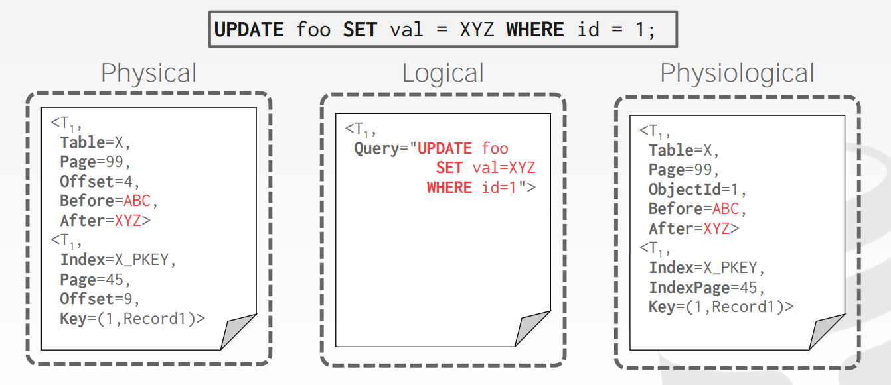

# Logging Protocols + Schemes

恢复算法是在发生故障时确保数据库一致性、事务原子性和持久性的技术。DBMS 根据底层的存储设备被分成了不同的组成部分。我们必须分清楚不同部分造成的错误，相应的解决。

每一个恢复算法都有这个两部分：
- 正常事务处理期间的操作，以确保 DBMS 可以从故障中恢复。
- 将数据库恢复到确保原子性、一致性和持久性的状态失败后的操作。

我们将在恢复算法中使用的关键原语是 UNDO 和 REDO。 并非所有算法都使用这两种方法：
- **UNDO:** 消除不完整或中止事务的影响的过程。
- **REDO:** 为持久性重新设置已提交事务的效果的过程。

### Failure Classification

**Type #1: Transaction Failures**

- **Logical Errors:** 由于某些内部错误条件（例如，完整性、违反约束），事务无法完成。
- **Internal State Errors:** 由于错误条件（例如死锁），DBMS 必须终止活动事务。

**Type #2: System Failures**

- **Software Failure:** DBMS 实现存在问题（例如，未捕获的被零除异常）并且系统必须停止。
- **Hardware Failure:** 托管 DBMS 的计算机崩溃。我们假设非易失性存储内容不会因系统崩溃而损坏。

**Type #3: Storage Media Failure**

- **Non-Repairable Hardware Failure:** 磁头崩溃或类似的磁盘故障会破坏全部或部分非易失性存储。假设破坏是可检测的。没有 DBMS 可以从中恢复。必须从存档版本恢复数据库。

### Buffer Pool Management Policies

**Steal Policy:** DBMS 是否允许未提交的事务覆盖非易失性存储中对象的最近提交的值（事务可以将未提交的更改写入磁盘）。

- **STEAL:** 允许
- **NO-STEAL:** 不允许

**Force Policy:** DBMS 是否确保在允许提交事务之前，事务所做的所有更新都反映在非易失性存储上。

- **FORCE:** 允许
- **NO-FORCE:** 不允许

强制写入会让恢复变得容易但会导致羸弱的性能。

最简单的实现：NO-STEAL + FORCE
- DBMS 永远也不会 UNDO 那些中断的事务，因为这些事务所做的修改永远不会写入到磁盘中。
- 它也永远不会去 REDO 那些已经提交的事务，因为所有的修改都是已经提交的事务所做的修改。
- 缺点：如果一个事务需要修改的所有数据都不能全部放入内存，那么该事务将无法执行，因为不允许 DBMS 在事务提交之前将脏页写出到磁盘。

### Shadow Paging

DBMS 维护数据库的两个独立副本（master、shadow）。 仅在 shadow 中进行更新。当事务提交时，原子地切换 shadow 成为 master。

这是一个 NO-STEAL + FORCE 系统的例子。

- 以树结构组织数据库页面，其中根是单个磁盘页面。
- 树有两个副本，master 和 shadow：
  - 根部指向 master。
  - 只在 shadow 更新。
- 要安装更新，请覆盖根，使其指向 shadow，从而交换 master 和 shadow。
  - 在覆盖根之前，所有事务更新都不是磁盘驻留数据库的一部分。
  - 覆盖根后，所有事务更新都是磁盘驻留数据库的一部分。
- **UNDO:** 删掉 shadow 页。
- **REDO:** 不需要。

### Write-Ahead Logging

在对磁盘页面进行更改之前，DBMS 会将对数据库所做的所有更改记录在一个 log 文件中（在稳定存储上）。该日志包含足够的信息来执行必要的撤消和重做操作以在崩溃后恢复数据库。

这是一个 STEAL + NO-FORCE 系统的例子。

几乎每个 DBMS 都使用预写日志 (WAL)，因为它具有最快的运行时性能。但是 DBMS 使用 WAL 的恢复时间比影子分页慢，因为它必须重放日志。

- 在页面本身被允许在非易失性存储中覆盖之前，与更新页面有关的所有日志记录都被写入非易失性存储。
- 在所有日志记录都写入稳定存储之前，不会认为事务已提交。
- 当事务开始时，为每个事务写入一个 \<BEGIN> 记录到日志中，以标记它的起始点。
- 当事务完成时，将 \<COMMIT> 记录写入日志并确保在向应用程序返回确认之前刷新所有日志记录。
- 每个日志条目都包含有关对单个对象的更改的信息：
  - Transaction ID.
  - Object ID.
  - Before Value (used for UNDO).
  - After Value (used for REDO).
- 事务提交时应将日志条目写入磁盘。您可以使用组提交将多个日志刷新批处理在一起以分摊开销。

### Logging Schemes

**Physical Logging:**
- 记录对数据库中特定位置所做的更改
- 示例：记录在页面中的位置

**Logical Logging:**
- 记录事务执行的高级操作。不一定限于单页。在每个日志记录中写入的数据比物理日志记录要少。如果您在非确定性并发控制方案中有并发事务，则难以使用逻辑日志实现恢复。
- 示例：事务调用的 UPDATE、DELETE 和 INSERT 查询。

**Physiological Logging:**
- 日志记录针对单个页面但不指定页面的数据组织的混合方法。
- 最常用的方法。

### Checkpoints

预写日志的主要问题是日志文件将永远增长。崩溃后，DBMS 必须重新执行整个日志，如果日志文件很大，这可能需要很长时间。因此，DBMS 可以定期获取一个 checkpoint，将所有缓冲区刷新到磁盘。

DBMS 多久执行一次检查点取决于应用程序的性能和停机时间要求。过于频繁地设置检查点会导致 DBMS 的运行时性能下降。但是，在检查点之间等待很长时间可能同样糟糕，因为系统在重新启动后的恢复时间会增加。

**Blocking Checkpoint Implementation:**
- DBMS 停止接受新事务并等待所有活动事务完成。
- 将当前驻留在主内存中的所有日志记录和脏块刷新到稳定存储。
- 将 \<CHECKPOINT> 条目写入日志并刷新到稳定存储。