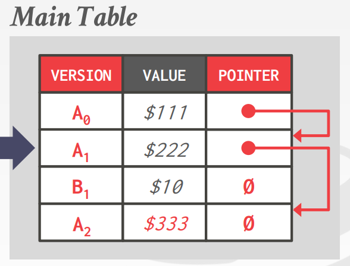
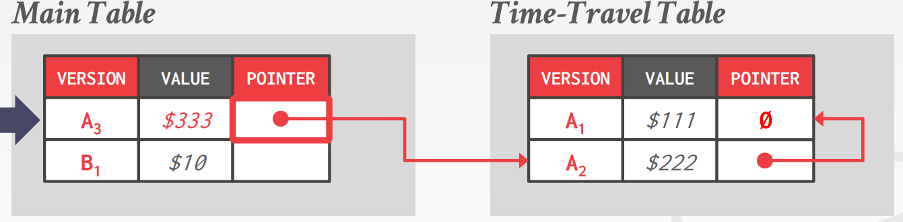
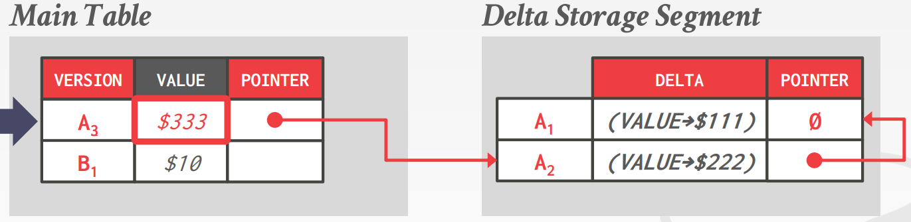

# Multi-Version Concurrency Control

多版本并发控制（MVCC）是一个比并发控制协议更大的概念，它类似于 git 这种版本控制思想。它设计到了 DBMS 设计和实现的方方面面。在 DBMS 中，MVCC 是一种很广泛被使用的。在过去十年里，它几乎被每个数据库所采纳，即使一些不支持多语句事务的系统（NoSQL）也会用它。

对于一个单独的逻辑对象，DMBS 会维护其多个物理版本。
- 当一个事务对一个对象写时，DBMS 会创建一个新的对于此对象的版本。
- 当一个事务读一个对象时，它会读取对象的最新版本当事务启动时。

### Key Properties

- **Writers don’t block the readers.**
- **Readers don’t block the writers.**

只读事务可以不需要获取锁来读取一致性快照。时间戳来决定可见性。

多版本 DBMS 会支持 time-travel query，这种查询可以读取特定时间点的快照。

四个重要的 MVCC 设计决定：
1. Concurrency Control Protocol (T/O, OCC, 2PL, etc).
2. Version Storage
3. Garbage collection
4. Index Management

### Version Storage

这是 DBMS 如何存储一个逻辑对象的不同物理版本的。

DBMS 将会使用元组的指针字段来创建对于每个逻辑对象的 **版本链**。这允许 DBMS 可以发现对于正在运行的事务可见的版本。索引总是指向链表的头部。一个线程遍历链表直到发现对其事务可见的版本。不同的存储策略决定了版本存储哪里或者存些什么。

**Approach #1: Append-Only Storage：** 新版本被附加在相同的表空间内。

- **Oldest-To-Newest (O2N):** 附加新版本到链的尾部，查找需要遍历真个表。
- **Newest-To-Oldest (N2O):** 链表的头部是新的，查找是快的，但是每次更新都要更新索引。

**Approach #2: Time-Travel Storage:** 老版本被复制到分离的表中。

**Approach #3: Delta Storage:** 修改后的属性的原始值被复制到单独的增量记录空间中。

### Garbage Collection

DBMS 需要随着时间的推移从数据库中删除可回收的物理版本。

**Approach #1: Tuple Level Garbage Collection:** 通过直接检查元组来查找旧版本。

- **Background Vacuuming:** 单独的线程定期扫描表并寻找可回收的版本，适用于任何版本存储方案。
- **Cooperative Cleaning:** 工作线程在遍历版本链时识别可回收版本。仅适用于 O2N。

**Approach #2: Transaction Level:** 每个事务都跟踪自己的读/写集。当事务完成时，垃圾收集器可以使用它来识别要回收的元组。 DBMS 确定由已完成事务创建的所有版本何时不再可见。

### Index Management

所有主键 (pkey) 索引始终指向版本链头。 DBMS 必须多久更新一次 pkey 索引取决于系统是否在更新元组时创建新版本。 如果事务更新了 pkey 属性，则将其视为 DELETE 后跟 INSERT。

管理二级索引更复杂：
- **Approach #1: Logical Pointers:** 每个元组使用一个不变的标识符。 需要一个额外的间接层，将逻辑 id 映射到元组的物理位置（主键与元组 ID）。
- **Approach #2: Physical Pointers:** 使用物理地址到版本链头。

