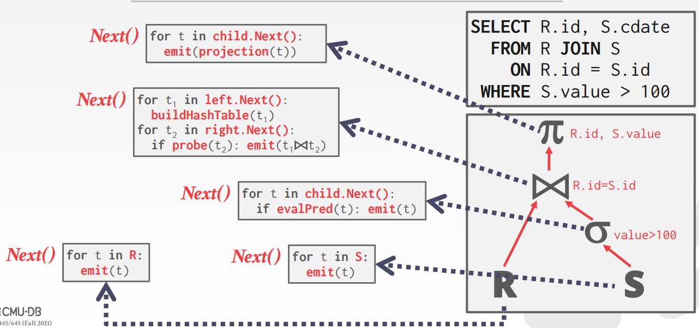

# Query Execution

### Query Plan

DBMS 会把一个 sql 语句转化为一次 query plan，而 query plan 是由一棵树组成的，数据流从叶子结点直到根部，根部的结果就是整个查询的结果。

### Processing Models

一个 DBMS 执行模型是定义如何执行一 qeury plan。不同的权衡对应着不同的工作量。

#### Iterator Mode

迭代模型也被称作火山模型或者流水线模型，是最常见的 processing model，几乎被用在所有的 DBMS。

对于每一次 operator 都实现一个 **Next** 函数，在 query plan 的每个结点都会调用 Next，直到 leaf node，之后开始发射 tuples 到父节点，每个 tuple 都会在下一个 tuple 到来之前尽可能的执行 plan，这样做可以尽可能的使用一个 tuple。
* 在每次调用 **Next**，operator 都会返回一个 tuple 或者当没有 tuple 发射时返回 null marker。
* operator 会实现一个循环对孩子结点调用 **Next** 来获取它的 tuples 然后执行它们，有点类似 dfs 回溯。

Iterator mode 允许流水线，那样 DBMS 可以在获取下一个 tuple 之前尽可能的对当前 tuple 执行更多的 operators。针对于单个 tuple 的一系列的任务被称作流水线。

有一些操作必须等到所有的 tuples 发射完全，例如：joins，subqueries，ORDER BY。这些操作被称作 pipeline breakers。

LIMIT 会让输出工作更容易，因为一旦 tuples 满了，就不再调用 Next 函数了。

#### Materialization Model

每次 operator 针对它的输入执行一次并且发射它的所有输出。
* operator 会 "materializes" 它的输出为单一的结果。
* DBMS 会向下提示避免扫描太多的 tuples。
* 输出可以是整个 tuple (NSM) 或者一个列的子集 (DSM)

这个方法更适合 OLTP 这种工作量不大，只执行很小的查询。

#### Vectorization Model

和 iterator model 一样，vectorization model 也会是实现 next 函数，但是发送的不是 tuple 而是 batch (i.e. vector) of data。

batch 的大小随硬件和查询性质而变化。

这个是 OLAP 的理想型，一个要扫描许多的 tuples，而调用更少的 Next。

#### Processing Direction

**Approach #1: Top-to-Bottom**
– 从根结点开始，从孩子结点拉去数据到父节点
– tuples 总是由函数调用来传递
**Approach #2: Bottom-to-Top**
– 从叶子结点开始，向上推送数据
– 可以更严谨的控制寄存器和缓存

### Access Methods

***access*** 是 DBMS 如何去访问存在 table 中的数据。总的来说，有两种方法：1. 直接从表中顺序扫描 2. 通过 index 顺序扫描。

#### Sequential Scan

Sequential scan 会迭代 table 中的每一个页然后从 buffer pool 中获取，在扫描 tuples 时，它会计算是否满足谓词来决定是否发送到下一个 operator。

Sequential page scan 几乎是 DBMS 中最低效的部分，但有很多优化点：
* **Prefetching:** 提前获取下几页，当访问每个页时，DBMS 不要阻塞 I/O。
* **Buffer Pool Bypass:** 扫描 operator 将从磁盘获取的 pages 存储在其本地内存而不是缓冲池中，以避免顺序泛滥。
* **Parallelization:** 通过多线程执行扫描。
* **Zone Map:** 提前计算一些 tuple 属性的 Aggragation 在一页中，DBMS 可以决定访问这个页之前可以先看一下它的 zone map。Zone map 被存储在独立的页中。
* **Late Materialization:**  在 DSM DBMS 可以延迟将元组拼接在一起，直到查询计划的上半部分。简单点说就是我要选的那一列，不想上传真是的数据，而只是 offsets。
* **Heap Clustering:** 元组使用聚集索引指定的顺序存储在 heap 页中。 

#### Index Scan

DBMS 可以在 index 中找到 query 需要的 tuples。
当然所被用的 index 也是有要求的：
* index 包含的属性
* query 引用的属性
* 属性的值域
* 谓词组合
* index 是否是 unique keys

尽管选择哪个 Index 取决于很多因素，但其核心思想就是，越早过滤掉越多的 tuples 越好。

### Modification Queries

一些要修改数据的操作（INSERT, UPDATE, DELETE）是有责任去检查约数和更新 index。对于 UPDATE/DELETE，child 操作要传递 Record IDs 到目标 tuples 并且要追踪之前看过的 tuples。而对于 INSERT：
* 在运算符内部实现元组。
* 运算符插入从子运算符传入的任何元组。

#### Halloween Problem
Halloween Problem 是 update 操作会改变 tuples 的物理结构，会造成 scan operator 对于访问 多次同一个 tuple，这会出现在聚簇索引和索引扫描上。

### Expression Evaluation

DBMS 会用一棵树来表示一个 where 语句，但是这样效率太低了，通常会直接比较（JIT compilation）。

