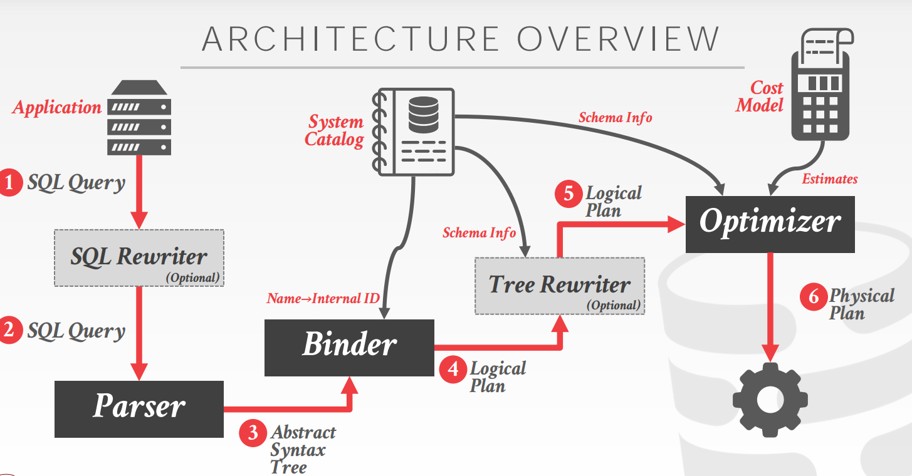

# Query Planning & Optimization

SQL 是声明性的，它告诉 DBMS 它想要的，而不是告诉 DBMS 怎么得到答案。因此 DBMS 需要翻译 SQL 语句成为一个可执行的 query plan。但即便是同一个 SQL 语句也会有多个 query plan，不同的 query plan 有着不同的性能，DBMS 要从中找到最优的 query plan，这个工作就被称作 DBMS's optimizer。

通常有两种优化策略：
* **Heuristics/Rules:** 重写 query 移除无效的东西，
* **Cost-based Search:** 使用成本模型来评估对等的 query plan，挑选出最优的。

### Rule-based Query Optimization

如果两个关系代数表达式的结果是相同的子集，那么称它们是相同的。基于此，DBMS 可以确认更好的 query plan 而不需要 cost model。这被称作 query rewriting。

Examples of query rewriting:
* **Predicate Push-down:** 在 join 之间执行谓词过滤。
* **Projections Push down:** 提前预测出需要的 tuples attributes，制造更少 tuples，减少中间结果。
* **Expression Simplification:** 利用布尔逻辑的传递特性重写谓词将表达式转换为更简单的形式。