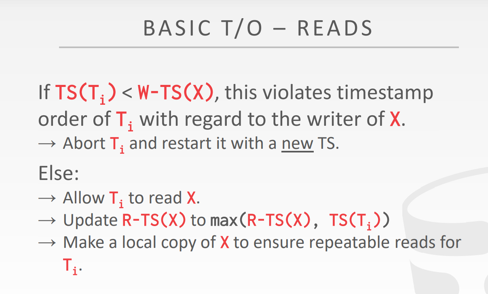
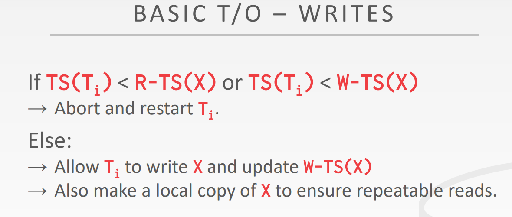
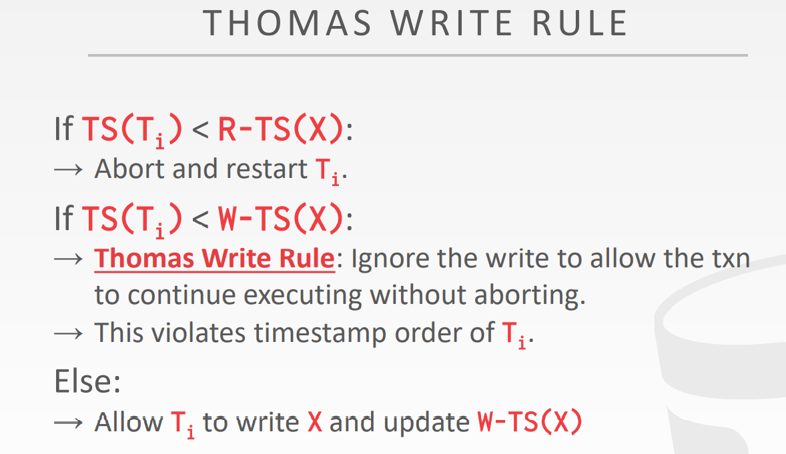
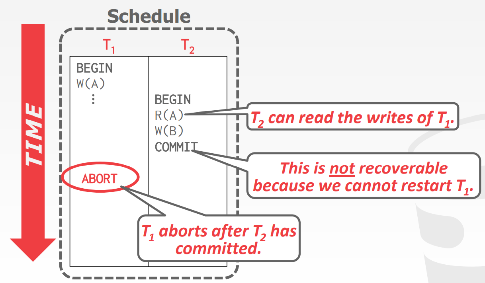
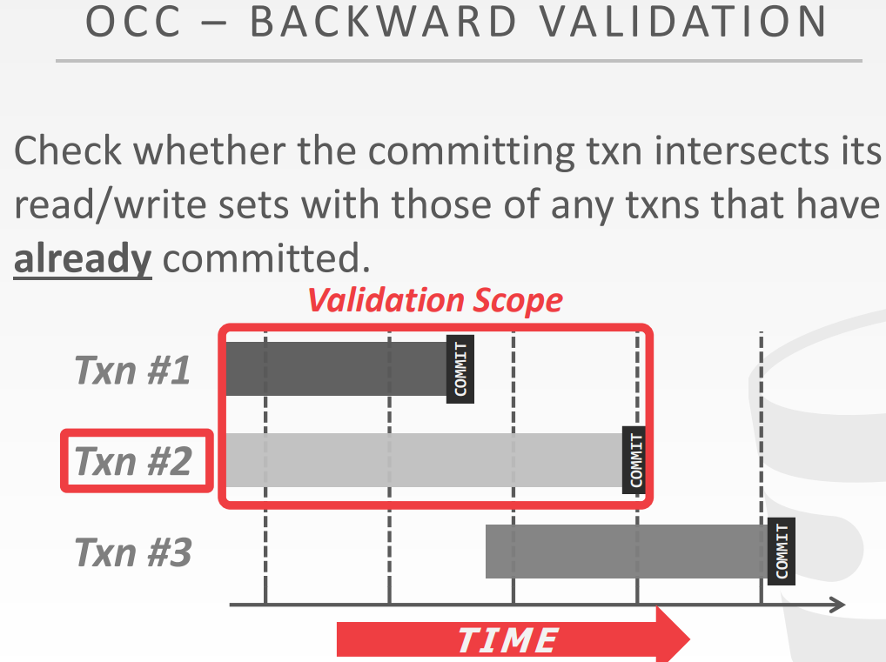
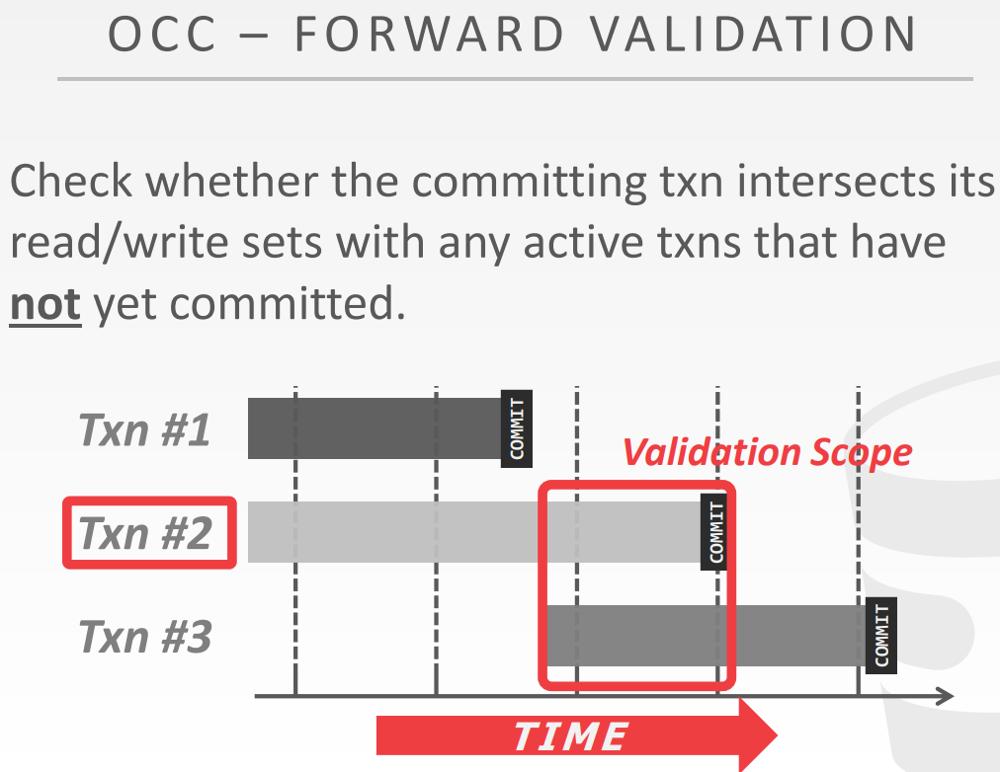

# Timestamp Ordering Concurrency Control

上一节介绍了并发控制协议中的悲观协议-两阶段锁，这一节主要介绍乐观协议。

### Timestamp Ordering Concurrency Control

**Timestamp ordering (T/O)** 是假设数据库内的事务之间的并发冲突很少，不再每次使用对象时获取锁，而是增加一种时间戳的属性，时间戳来决定调度串行的事务。

每个事务被分配一个单独的单调递增的时间戳 $$TS(T_i)$$。

不同的方案会给事务在不同的时间分配时间戳，不一定是事务开始或者结束，可以是中途。

**基本准则：** 如果 $$TS(T_i) < TS(T_j)$$，DBMS 必须保证 $$T_i$$ 执行要在 $$T_j$$ 前面。

时间戳的选择是多样的，可以是 system clock，也可以是 logic counter，一般是二者混用。

### Basic Timestamp Ordering (BASIC T/O)

BASIC T/O 允许读和写数据库的对象而不需要锁，相反的每个数据库对象 X 都被贴上时间戳的标签：成功执行了读操作 R-TS(X) 和成功执行了写操作 W-TS(X)。DBMS 在每次操作的时候都会去检查时间戳。如果一个事务尝试去访问一个对象但却违反了时间戳顺序，这个事务要么中断要么重启。而我们底层的假设是这样的冲突是稀少的而重启也将会是稀少的。

#### Read Operations

如果是读操作，我们希望我们操作的时间戳不小于 tuple 的写时间戳，因为我们不希望读到未来值，一旦这个未来值失效了，我们又要rollback 了。
如果 TS($$T_i$$) < W-TS(X)，这违反了 $$T_i$$ 的写者时间戳，直接中断 $$T_i$$ 并且重启新的事务 **TS**。
否则，读操作是有效的，DBMS 将更新 R-TS(X) = max(R-TS(x), TS($$T_i$$))。然后要 copy 一份 X 来确保可重复度为了事务 $$T_i$$。

#### Write Operations

如果是写操作，我们希望我们操作的时间戳要不小于 tuple 的读时间戳，因为我们一旦我们成功写入了，那么之前的值就不存在了，但它还被其他事务读取了，这就不对了。而且我们希望我们操作的时间戳同时要不小于 tuple 的写时间戳，因为一旦成功写入，那么我们就覆盖了之前的事务的写。
如果 TS($$T_i$$) < R-TS(X) or TS($$T_i$$) < W-TS(X)，直接中断或者重启 $$T_i$$。
否则，读操作有效，并且 copy 一份 X 确保重复读。

#### Optimization: Thomas Write Rule

托马斯优化实际是防止重复写而导致的事务中断，有些写操作的时间戳小于 tuple 的写时间戳，但是这是允许的。

如果不适用 Thomas Write Rule，这样的时间戳协议是可以生成的调度是 conflict serializable。
- 不存在死锁的问题。
- 可能存在长事务的 starvation，由于短事务的冲突。

我们来讨论另一件事情，时间戳协议承诺 schedule 是不可恢复的。

一个 schedule 是可恢复的指的是一个事务只有当它所依赖的事务已经提交了的情况下，它在提交。所以 DBMS 无法保证事务读取的数据会在从崩溃中恢复后恢复。

#### Basic T/O Potential Issues

- 将数据复制到事务的工作区和更新时间戳的高开销。
- 长时间运行的事务可能会饿死。 事务从较新事务中读取某些内容的可能性增加。
- 在高并发系统上受到时间戳分配瓶颈的影响。

其实 T/O 协议和 2PL 协议都一样，它们都是悲观的。只不过后者是锁，前者是时间戳，它们都存在大量争抢的情况。

### Optimistic Concurrency Control (OCC)

OCC 是另一种也是使用时间戳的乐观并发协议。如果系统中又很少的 conflict 或者是只读的情况，使用 OCC 会很好。

OCC 怎么工作的？DBMS 会创建 private workspace 对于每个事务。所有的对于事务的修改，首先会将数据复制到私人空间，然后在私人空间修改。当事务提交时，DBMS 会比较私人空间的 write set 是否和其他事务发生冲突。如果没有冲突，则应用到全局空间中。

OCC 包含三个阶段：
1. **Read Phase:** DBMS 跟踪事务的读/写集并将其写入存储在私有工作空间中。
2. **Validation Phase:** 当一个事务提交时，DBMS 会检查它是否与其他事务冲突。
3. **Write Phase:** 如果验证成功，DBMS 将私有工作区更改应用到数据库。 否则，它将中止并重新启动事务。

#### Validation Phase

DBMS 分配给事务一个时间戳当它进入到 validation phase。为了确保 serialzable schedule，DBMS 必须检查此事务是否和其他事务发成了 RW 或者 WW 冲突并且确保所有的冲突朝着一个方向解决（older → younger）。

检查与 T2 并发并且在 T2 之前的事务。

检查与 T2 并发并且在 T2 之后的事务。保证 T2 修改的对象不被并发事务所读。

#### Potential Issues

- 将数据本地复制到事务的私有工作区的高开销。
- 验证/写入阶段瓶颈。
- 中止可能比其他协议更浪费，因为它们只发生在事务已经执行之后。
- 遭受时间戳分配瓶颈。

### Partition-Based T/O

当一个事务在 OCC 中提交时，DBMS 会检查是否与整个数据库的并发事务发生冲突。如果我们有很多并发事务，这会很慢，因为 DBMS 必须获取锁来执行所有这些检查。

另一种方法是将数据库拆分为不相交的子集，称为分区（也称为分片），然后仅检查在同一分区中运行的事务之间的冲突。

#### Potential Issues

- 如果满足以下条件，则基于分区的 T/O 协议速度很快：(1) DBMS 在事务开始之前就知道事务需要哪些分区，以及 (2) 大多数（如果不是全部）事务只需要访问单个分区。
- 该协议仅在以下情况下有效：（1）事务是存储过程（网络通信导致分区空闲，因为它必须等待下一个查询执行）和（2）事务只涉及一个分区（多分区事务导致分区被空闲，因为分区必须等待下一个查询执行）。

