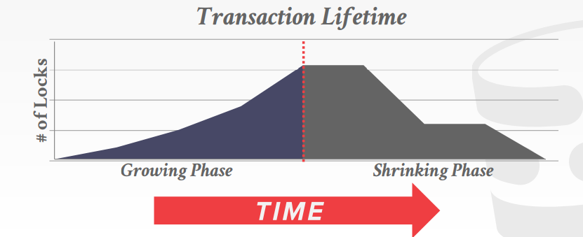
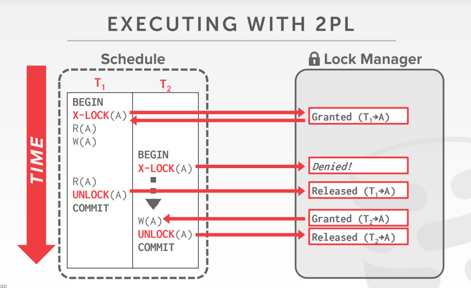
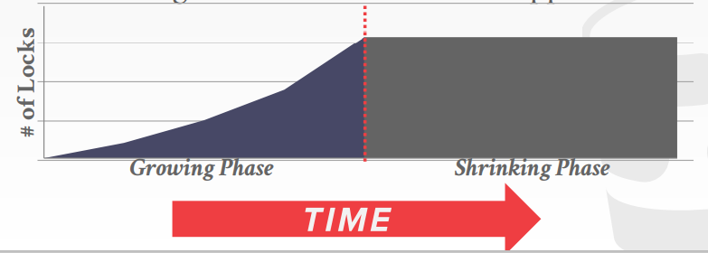
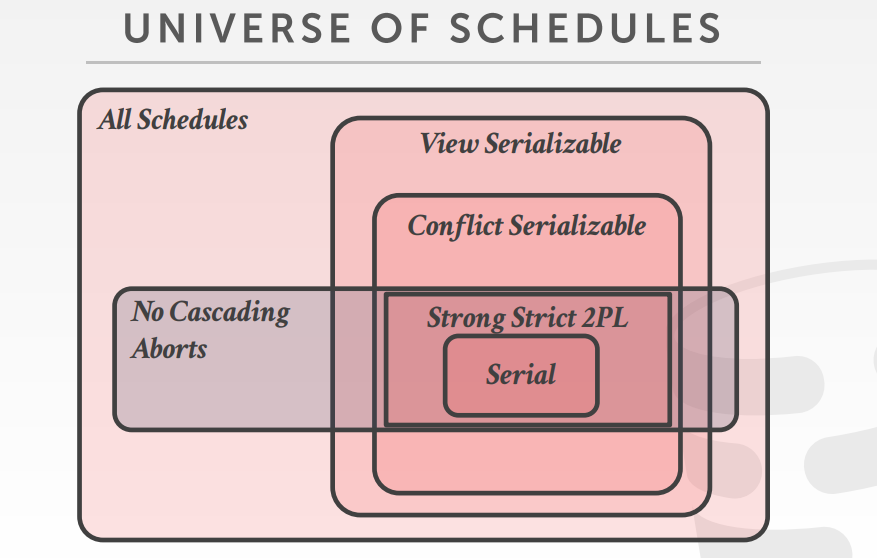
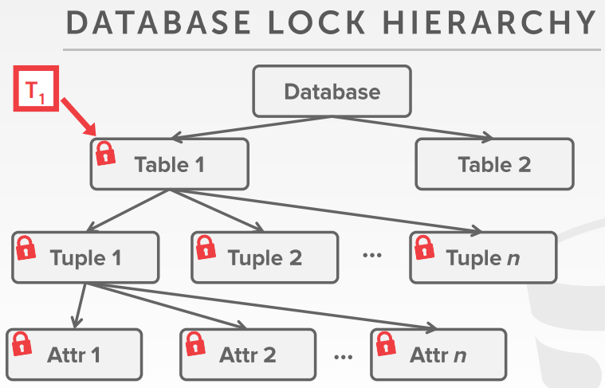

# Two-Phase Locking Concurrency Control

上一节说到 DBMS 在解决 Isolation 时会有并发冲突，此时需要 schedule 来调节事务之间的序列，最明显的是 conflict serializability 和 view serializability。

我们需要一种方式来实现正确的 execution schedule 而且不需要提前知道整个 schedule。

### Transaction Locks

DBMS 使用 **锁** 来动态的生成 execution schedule 来让事务是可序列化的，而且不需要提前知道事务的读写情况。这些锁帮助数据库当它们要多次读写时的并发访问。DBMS 会实现一个 lock manager 来决定一个是事务是否获取锁，它会提供一个全局的视野来看系统内部发生了什么。

有两种基本的锁（类似于读写锁）：
- **Shared Lock (S-LOCK):** 允许多个事务读相同的对象。如果一个事务持有了共享锁，那么其他事务也可以持有。
- **Exclusive Lock (X-LOCK):** 独占锁只允许一个事务修改对象。这个锁会阻止其他的事务来修改或者读这个对象。

DBMS 内部的 lock manager 会管理内部 lock table 那个事务持有那个锁，那个事务等待获取那个锁。

### Two-Phase Locking

两阶段锁是一种悲观协议（pessimistic），它使用锁来决定一个事务是否应该访问那些在数据库里的对象。此协议并不需要提前知道事务中的所有的查询。阶段的对象指的时事务。

**Phase #1– Growing:** 在增长阶段，每个事务都需要从 lock manager 中获取它需要的锁。由 lock manager 来决定是否给予事务相应的锁。
**Phase #2– Shrinking:** 在事务进入增长阶段之后释放第一个锁的瞬间他就进入了缩小阶段，在缩小阶段事务只允许释放锁，不允许获取锁。

2PL 是充分满足 conflict serializability，它生成的调度的依赖图是无环的。但是它是可能会出现 *cascading aborts*，当一个事务 abort 的时候，另一个使用了它所修改对象的事务必须要回归，这就造成了浪费工作。

#### Strong Strict Two-Phase Locking

强严格两阶段锁其实就是多加了一个限制，只有当事务提交的时候才会释放锁。

这个方法的优势是不会出现级联中断，然而古尔丹，代价是什么？更少的吞吐量。这是一个更悲观的协议。

### Deadlock Handling

死锁是事务之间为了获取锁而形成了环形等待，都在等待彼此释放。有两种办法可以解决死锁：检测和阻止。

**Approach #1: Deadlock Detection**

为了检测死锁，DBMS 创建了 *waits-for* 图，其中事务是结点，如果 $$T_i$$ 等待 $$T_j$$ 释放一个锁那么存在一条从 $$T_i$$ 到 $$T_j$$ 的有向边。

系统会创建一个后台线程定时的检测是否出现了环，会做出决定怎么来破坏环。

当 DBMS 检测到死锁的时候，他会选择一个受害者事务，杀死它，来解决环。受害者事务要么重新启动，要么依据应用怎么调用它。

DBMS 会考虑多个事务属性来选择 victim：
1. By age (newest or oldest timestamp).
2. By progress (least/most queries executed).
3. By the *#* of items already locked.
4. By the *#* of transactions needed to rollback with it.
5. *#* of times a transaction has been restarted in the past (to avoid starvation).

在选择一个受害者事务中断之后，DBMS 可以选择回滚多远的事务改变，它可以要么回滚整个事务，或者回归到足够破坏死锁。

**Approach #2: Deadlock Prevention**

取而代之的让事务去获取任何它们需要的锁然后解决死锁，死锁预防是在它们造成死锁的之前来阻止死锁的出现，MYSQL 是这样做的。
一旦有事务要获取一个死锁，那么 DBMS 会杀死形成死锁的事务的其中一个。为了实现这个，事务会被分配一个时间戳属性，老的事务有更高的优先级。

有两种方法在死锁预防下杀死事务：
- **Wait-Die (“Old Waits for Young”):** 如果 requesting 事务比 holding 事务有着更高的优先级，那么它等待，否则它中断。
- **Wound-Wait (“Young Waits for Old”):** 如果 requesting 事务比 holding 事务有着更高的优先级，那么 holding 事务中断并且释放锁，否则 requesting 事务等待。

### Lock Granularities（锁粒度）

如果一个事务要更新 1 亿的元组，那么他要向 DBMS 的 lock manager 申请 1 亿次锁。这显然是很慢的，但是我们又必须需要获取锁来更新数据库的元数据。

为了避免这种开销，DBMS 可以使用一种 **lock hierarchy** 来允许事务获取一些更粗粒度的锁。例如它可以获取一个表的锁而不是表内所有的元组的锁。当一个事务获取对象的锁的时候，它已经隐式的获取了它的子对象的所有的锁。

**Intention locks** 允许更高层级的结点来获取 shared or exclusive mode。如果一个结点是在 intention mode，那么显式，它的锁是被应用在了子孙树的低级层级。

- **Intention-Shared (IS):** 表示使用共享锁在较低级别进行显式锁定。
- **Intention-Exclusive (IX):** 使用排他锁或共享锁指示较低级别的显式锁定。
- **Shared+Intention-Exclusive (SIX):** 以该节点为根的子树在共享模式下显式锁定，并且显式锁定在较低级别使用独占模式锁定完成。